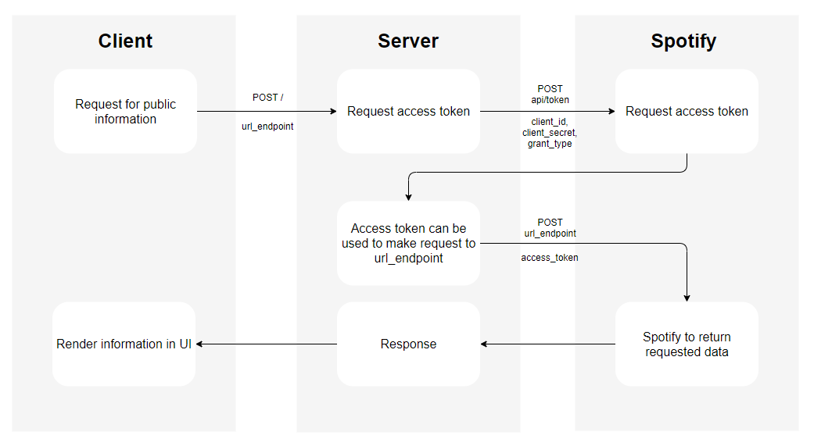
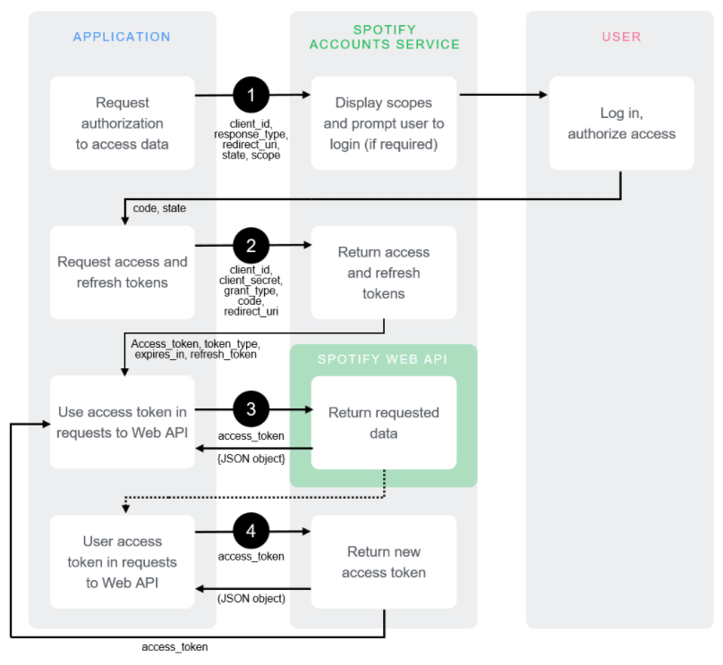

# Spotify Clone App Authenication Server
This repository is the code to run an authorization/authentication server to connect to the Spotify API. The server is to be used in conjunction with the front-end code of the cloned app found [here](https://github.com/JL978/spotify-clone-client)

## Motivation
When working with the [Spotify API](https://developer.spotify.com/documentation/web-api/), you must follow this authorization [guide](https://developer.spotify.com/documentation/general/guides/authorization-guide/) provided on the API documentation. The basis of this authorization flow involve using a client id and client secret provided by signing up on the Spotify Developer dash board. These keys must be sent with every single request made to the Spotify server. 

When working with a client secret, one must keep it... well secret. Therefore, the solution to this is to keep the requests to the Spotify API on the server-side so that the client-side app can't expose the secret key to potential attackers - making the app more secure. Authenitcation of users are also done through this server for the same purpose and a refresh_token is sent back as a cookie while an access token is sent back to be stored in memory. This authorization flow was built to avoid the most common types of cyber attack - Cross Site Scripting and Cross Site Request Forgery.

## Tech/Framework Used
* Node.js
* Express.js
* axios

## Installation
This project requires [node](http://nodejs.org) and [npm](https://npmjs.com) installed globally. 

Clone the repository to a directory of your choosing

```sh
$ git clone https://github.com/JL978/spotify-clone-server.git
```
Navigate into spotify-clone-server and install the necessary packages

```sh
$ npm install 
```
To run the server

```sh
$ npm start
```
To run the dev server

```sh
$ npm run dev
```

### **Other requirements**
[The Spotify Developer Dashboard](https://developer.spotify.com/dashboard/login)

Create a new .env file in the root folder and add the following key value pairs to the file

```sh
CLIENT_ID = [client id optained from the Spotify Developer Dashboard]
CLIENT_SECRET = [client secret optained from the Spotify Developer Dashboard]
FRONT_URI = http://localhost:3000
RE_URI = http://localhost:4000/callback
REXP = /\.localhost:3000/
```

## Usage

This server is to be consumed by a front-end application - namely the Spotify clone at this [repo](https://github.com/JL978/spotify-clone-client)

The following endpoints are available

|Endpoint|Method|Body|Response|
|:---|:---|:---|:---|
|/|POST|{endpoint}|200 with the returned data from the endpoint|
|/login|GET|none|redirect to the Spotify authentication page|
|/refresh_token|GET|none|if a valid refresh token is available in the cookie, an access_token is sent back as data|
|/logout|GET|none|clear the refresh token and effectively log the user out off the app|

## The architecture
### Client Credential Flow (un-authorized requests)



The advantage of doing request this way instead of using the implicit grant flow as outlined in the Spotify API document is that you have a higher rate limit. It also doesn't prompt the user to login, which would be a bad experience for users who don't have a Spotify account but just want to browse their selections. 

An improvement to this process would be to store the access_token in memory after the first request and use that for subsequent requests instead of requesting for a new access token on every request.

### Authorization code flow 

The majority of code flow is very similar to the authorization code flow as outlined in the API [documentation](https://developer.spotify.com/documentation/general/guides/authorization-guide/), a diagram of which is shown bellow



The only difference with this server is that the sent back data at step 2 is the access_token as JSON so that the client can store that in memory (the client will now show the logged in version of the app) and set the refresh token in a cookie. At this point the client is free to make requests for personal data as outlined in step 3-4 however an issue would arise if the user refreshed the page. Since the access_token is stored in memory, the user would be logged out during page refresh and provide a bad user experience. To solve this issue, a /refresh_token endpoint is also provided. During any initial loading, the client checks for if their is a refresh_token stored in a cookie, if there is then it makes a request to the /refresh_token endpoint which uses the refresh_token to obtain a new access_key from the Spotify API. 


### Logging out

Since "logged in" just means that there is a refresh_token stored in cookies, to log the user out it is simply deleting the cookie and refresh the client.
